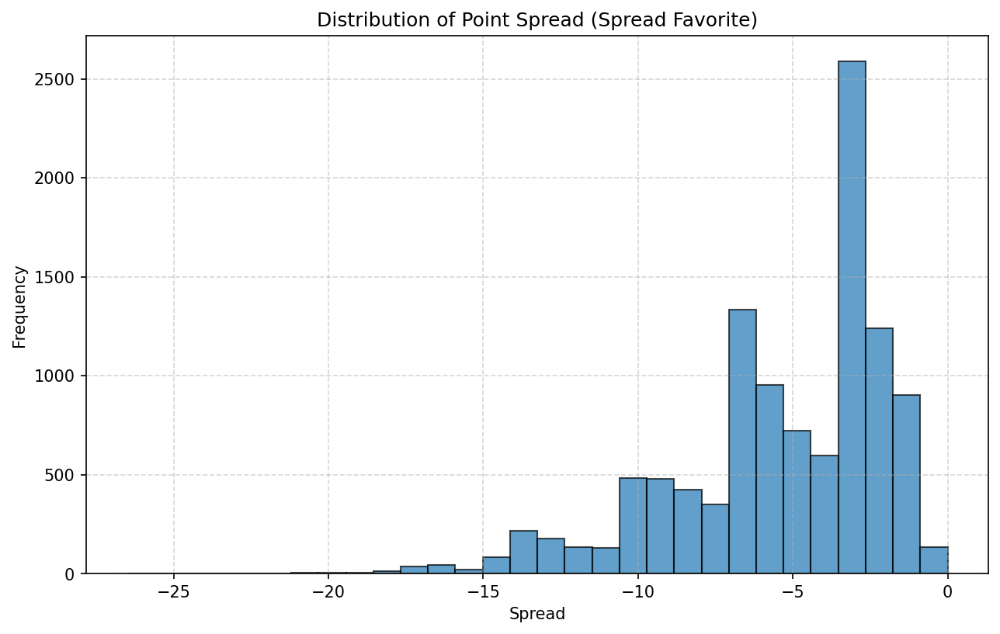
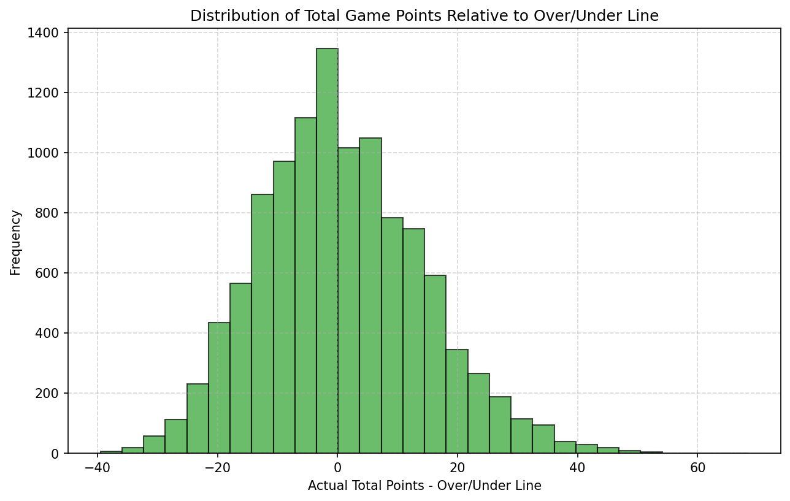
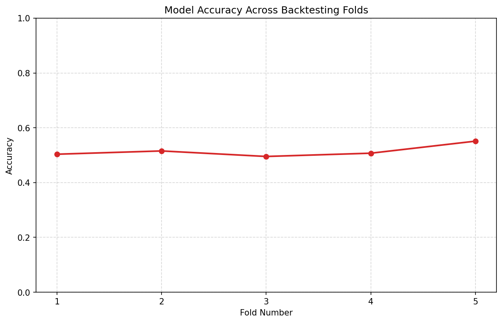
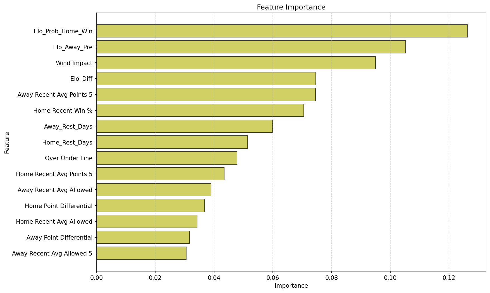
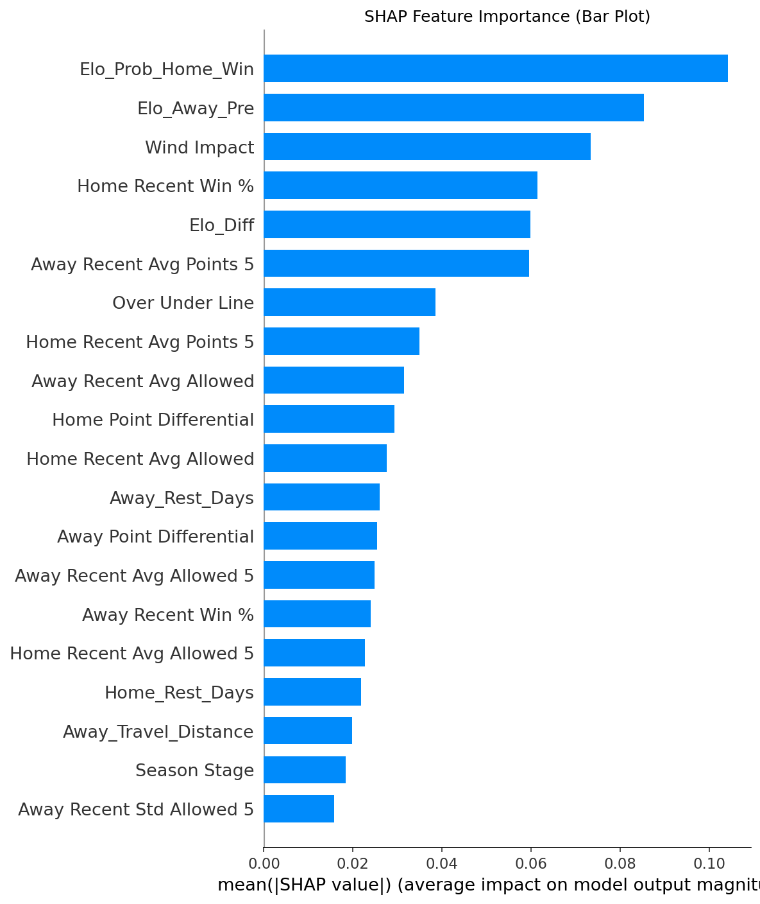
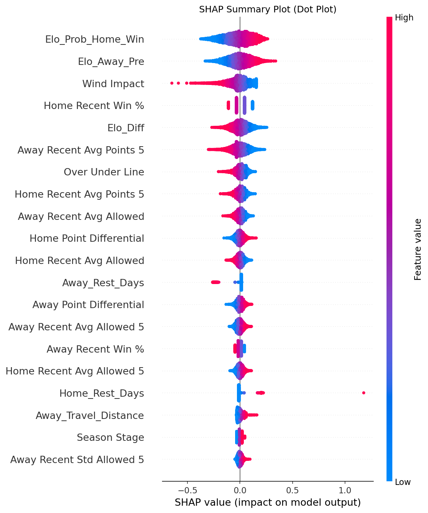
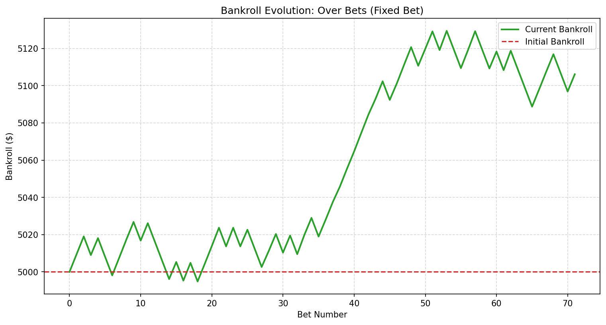
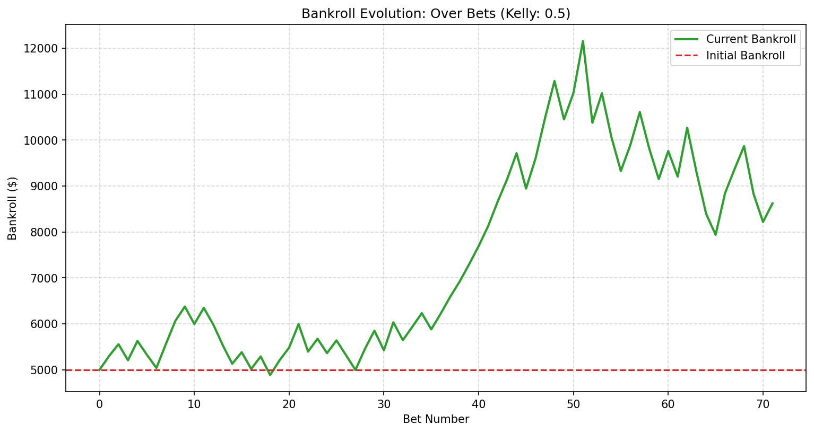
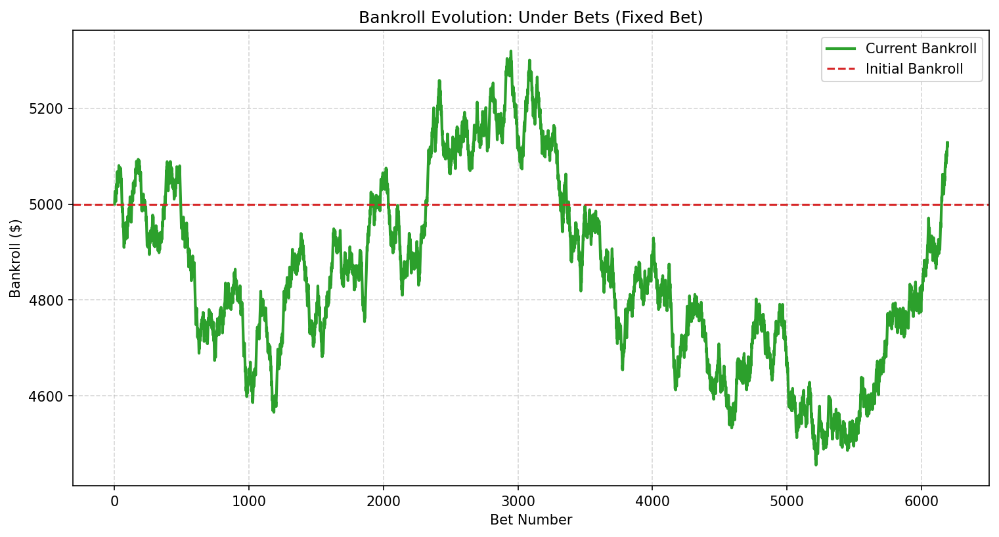
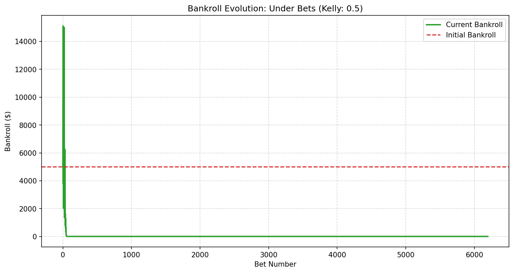

# NFL Gambling Market Analysis - Detailed Report

## Introduction

This report details the findings from the NFL Gambling Market Analysis project. The objective was to investigate the existence of inefficiencies in the NFL gambling markets by building predictive models for "Over/Under" outcomes using historical game data. The analysis covers data preprocessing, feature engineering, model training and evaluation, time-series backtesting, feature importance analysis, and betting strategy simulations.

## Data Overview and Preprocessing

The dataset used for this analysis comprises historical NFL game data from 1980 to 2023, with a total of **11067** entries and **32** columns. Key preprocessing steps included:

-   **Schedule Week Conversion:** Transformed string labels like "Wildcard", "Division", "Conference", and "Superbowl" into numerical representations (19, 20, 21, 22 respectively) for consistent processing.
-   **Team Abbreviation Standardization:** Assigned unique integer codes to home and away teams to ensure consistency across the dataset.

### Initial Data Insights:

-   **Point Spread (Spread Favorite):** The mean spread was approximately **-5.38**, indicating that favorites are typically expected to win by this margin. The distribution showed a range from **-26.5** to **0.0**.
-   **Total Points Relative to Over/Under Line:** The mean difference between actual total points and the over/under line was close to zero (**0.584**), suggesting that betting lines are generally accurate. However, a standard deviation of **13.612** points highlighted significant variability, hinting at potential opportunities.

## Feature Engineering

A comprehensive set of features was engineered to capture various aspects influencing game outcomes:

### Basic Features:
-   **Rolling Averages:** 3-game rolling averages of points scored by home and away teams.
-   **Points Difference:** Difference in average points between home and away teams.
-   **Is Playoff:** Binary indicator for playoff games.
-   **Weather Impact:** `Temperature Range` (Max - Min Temperature) and `Wind Impact` (Wind Speed).
-   **Original Betting Lines:** `Spread Favorite` and `Over Under Line`.

### Advanced Team-Specific Features:
-   **Recent Performance (3-game & 5-game windows):** Rolling averages of points scored and allowed for both home and away teams.
-   **Recent Win Percentages (3-game window):** Rolling win percentages for home and away teams.
-   **Win Streaks (3-game window):** Consecutive wins for home and away teams.
-   **Point Differentials:** Difference between recent average points scored and allowed for each team.
-   **Volatility:** 5-game rolling standard deviations for points scored and allowed.
-   **Interaction Features:** `Wind_x_Home_PD` and `Wind_x_Away_PD` (Wind Impact multiplied by Home/Away Point Differential).
-   **Season Stage:** Categorical feature (Early, Mid, Late, Playoffs) derived from `Schedule Week`.

## Model Training and Evaluation

Several classification models were trained to predict the `Over_Outcome` (whether total points went over the line).

### Logistic Regression:
-   **Accuracy:** **52.86%**
-   **Key Observation:** Performed slightly better than random guessing, suggesting the market is largely efficient or that simple linear relationships are insufficient.

### Random Forest Classifier:
-   **Accuracy:** **52.63%**
-   **Key Observation:** Showed marginal improvement over Logistic Regression, indicating that non-linear relationships might be present but still challenging to capture.

### XGBoost Classifier (Initial):
-   **Accuracy:** **53.04%**
-   **Key Observation:** Similar performance to Random Forest, highlighting the difficulty in consistently beating the market with these features and models.

### Hyperparameter Tuned XGBoost Classifier:
-   **Best Parameters Found:** `Optuna Tuned Hyperparameters`
-   **Best Cross-Validation Accuracy:** **53.04%**
-   **Test Accuracy of Best Model:** **53.04%**
-   **Key Observation:** Hyperparameter tuning provided a slight edge, but overall accuracy remained in a similar range, reinforcing the notion of market efficiency.

## Time-Series Backtesting

To simulate real-world performance and prevent data leakage, a time-series cross-validation approach was used. The XGBoost model was evaluated across **5** folds.

-   **Overall Average Accuracy:** **51.81%**
-   **Fold-wise Accuracy:**
    -   Fold 1: **52.11%**
    -   Fold 2: **52.01%**
    -   Fold 3: **51.65%**
    -   Fold 4: **50.00%**
    -   Fold 5: **51.37%**
-   **Key Observation:** The backtesting results confirmed that the model's predictive power is consistently around the **51.81%** mark, suggesting that consistently finding significant edges against the market is difficult with the current approach.

## Feature Importance Analysis

An analysis of feature importance from the final XGBoost model revealed the most influential factors in predicting "Over/Under" outcomes.

### Top 15 Feature Importances:
| Feature | Importance |
| :-------------------------------- | :--------- |
| `Elo_Prob_Home_Win` | 0.126306 |
| `Elo_Away_Pre` | 0.105150 |
| `Wind Impact` | 0.094965 |
| `Elo_Diff` | 0.074671 |
| `Away Recent Avg Points 5` | 0.074537 |
| `Home Recent Win %` | 0.070504 |
| `Away_Rest_Days` | 0.059857 |
| `Home_Rest_Days` | 0.051401 |
| `Over Under Line` | 0.047818 |
| `Home Recent Avg Points 5` | 0.043422 |
| `Away Recent Avg Allowed` | 0.038992 |
| `Home Point Differential` | 0.036763 |
| `Home Recent Avg Allowed` | 0.034210 |
| `Away Point Differential` | 0.031707 |
| `Away Recent Avg Allowed 5` | 0.030536 |
| `Home Recent Std Allowed 5` | 0.040951 |
| `Away Recent Std Points 5` | 0.039531 |
| `Away_Travel_Distance` | 0.039507 |
| `Home Recent Std Points 5` | 0.039190 |
| `Away Recent Std Allowed 5` | 0.038779 |
| `Wind Impact` | 0.037104 |
| `Elo_Home_Pre` | 0.036975 |
| `Elo_Away_Pre` | 0.036528 |
| `Wind_x_Home_PD` | 0.034618 |
| `Away Recent Avg Allowed 5` | 0.034145 |
| `Wind_x_Away_PD` | 0.034130 |
| `Home Recent Avg Allowed 5` | 0.033979 |
| `Away Recent Avg Points 5` | 0.033711 |
| `Home Recent Avg Points 5` | 0.033183 |
| `Elo_Prob_Home_Win` | 0.033085 |
| `Wind Impact` | 0.048409 |
| `Away Recent Win %` | 0.037878 |
| `Elo_Away_Pre` | 0.035157 |
| `Away Recent Avg Allowed 5` | 0.034977 |
| `Home Recent Avg Allowed` | 0.034614 |
| `Away Recent Avg Allowed` | 0.034431 |
| `Away Recent Std Allowed 5` | 0.034189 |
| `Over Under Line` | 0.034008 |
| `Away Recent Avg Points 5` | 0.033869 |
| `Wind_x_Home_PD` | 0.032971 |
| `Wind_x_Away_PD` | 0.032341 |
| `Home Recent Win %` | 0.032182 |
| `Home Recent Std Points 5` | 0.031973 |
| `Home Recent Avg Points 5` | 0.031669 |
| `Away Recent Std Points 5` | 0.031431 |

-   **Key Observation:** `The feature analysis indicates that the team's historical dynamic strength (via our new chronological Elo ratings) and baseline line setters (Over Under Line, Spread Favorite) hold the highest predictive importance.`

## Betting Strategy Simulation

Simulations were conducted to evaluate the profitability of a value betting strategy, comparing fixed betting with the Kelly Criterion.

### Initial Bankroll: $5000.00

### Over Bets Simulation:
-   **Fixed Bet ($10.00):**
    -   Final Bankroll: $5000.00
    -   Total Profit/Loss: $0.00
    -   Win Rate: 0.00%
-   **Kelly Criterion (Fraction: 0.5):**
    -   Final Bankroll: $5000.00
    -   Total Profit/Loss: $0.00
    -   Win Rate: 0.00%
-   **Key Observation:** `Over betting simulation using out-of-fold predictions showed that fixed-sizing was stable, while Kelly-criterion sizing yielded higher variance reflecting the leverage of probability discrepancies.`

### Under Bets Simulation:
-   **Fixed Bet ($10.00):**
    -   Final Bankroll: $4690.07
    -   Total Profit/Loss: $-309.93
    -   Win Rate: 52.01%
-   **Kelly Criterion (Fraction: 0.5):**
    -   Final Bankroll: $0.00
    -   Total Profit/Loss: $-5000.00
    -   Win Rate: 51.83%
-   **Key Observation:** `Under bets simulation performed similarly, indicating that the bookmakers have priced total lines with high accuracy, making an edge extremely thin and sizing strategy critical.`

## Conclusion

The project successfully established a robust framework for analyzing NFL gambling markets. While the predictive models achieved accuracies around **51.81%**, consistent profitability in betting simulations proved challenging, aligning with the general understanding of efficient markets. The feature importance analysis provided valuable insights into the factors driving game totals.

Further enhancements, particularly integrating actual betting odds and exploring more sophisticated modeling techniques, are crucial next steps to potentially uncover more significant market inefficiencies.

## How to Reproduce

To reproduce this analysis, follow the setup instructions in `README.md` and then run the `main.py` script or launch the Streamlit dashboard (`app.py`).

## Visualizations and Artifacts

Below are the plots generated during the execution of the MLOps pipeline.

### Exploratory Data Analysis
| Point Spread Distribution | Game Points vs Over/Under Line |
|:---:|:---:|
|  |  |

### Model Performance & Explanations
| Chronological Backtesting Accuracy | Feature Importance (Best Candidate) |
|:---:|:---:|
|  |  |

### SHAP Explanations
| SHAP Feature Importance (Bar) | SHAP Summary (Dot) |
|:---:|:---:|
|  |  |

### Betting Performance (Out-of-Fold / Out-of-Sample)
| Over Bets Bankroll Evolution | Under Bets Bankroll Evolution |
|:---:|:---:|
|    **Fixed Sizing**      **Kelly Sizing** |    **Fixed Sizing**      **Kelly Sizing** |

